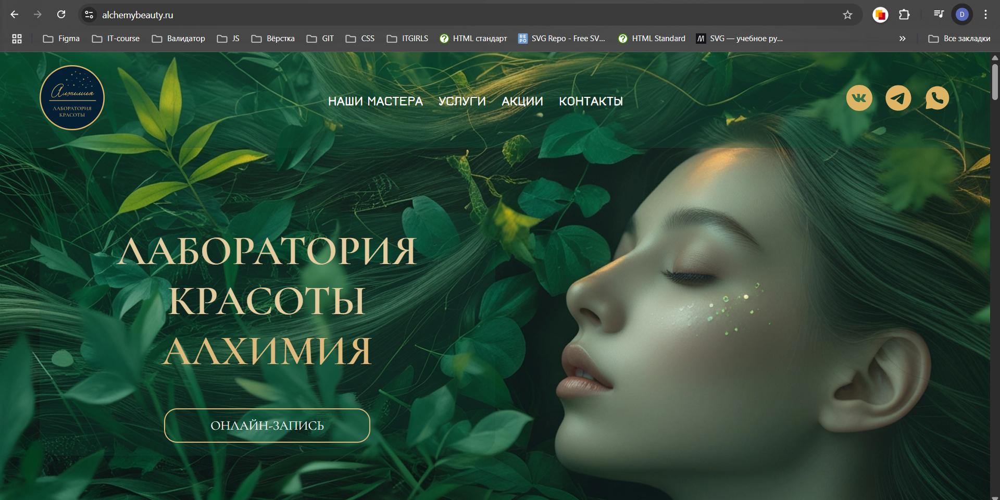
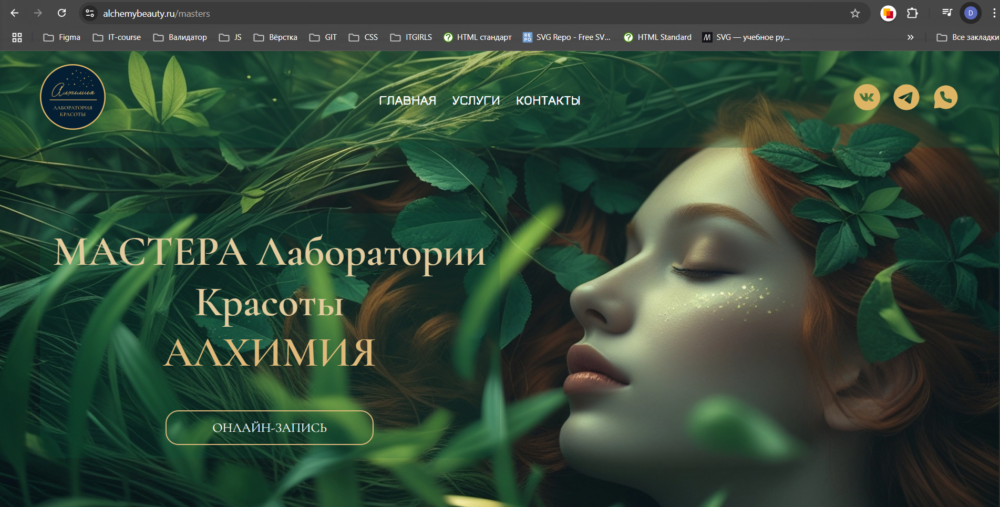
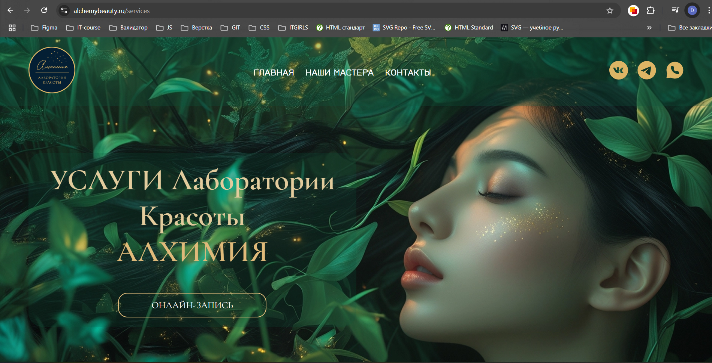
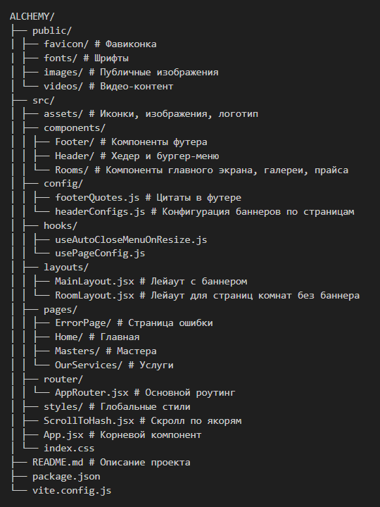

# ✨ Alchemy Beauty — сайт студии красоты

Современный сайт для студии красоты **Alchemy Beauty**, разработанный с нуля, "под ключ" на React + Vite. Включает адаптивную верстку, анимации, удобную и гибкую структуру с переиспользуемыми компонентами.

## 🌐 Демо

▶️ [alchemybeauty.ru](https://alchemybeauty.ru)

## 📸 Скриншоты





## 🔍 Описание проекта

Alchemy Beauty — это стильный и функциональный сайт, представляющий услуги студии красоты. Проект реализован с акцентом на UX/UI, адаптивность и SEO-оптимизацию. Структура кода модульная, с разделением на лейауты, компоненты и страницы.

## ✨ Основные возможности

🔹 Главная страница с анимацией, блоками "О нас", "Почему мы", "Наши услуги", "Команда", "Отзывы", "Промо", Контакты.  
🔹 Адаптивный хедер с анимированным бургер-меню  
🔹 Разделы: Мастера, Услуги, Комнаты (волос, ноготков, взгляда, загара), страница 404  
🔹 Отдельный лейаут для страниц комнат  
🔹 Переиспользуемая таблица прайсов с адаптивными табами, удобной вынесенной отдельной датой, для дальнейшего масштабирования и удобства внесения изменений  
🔹 Уникальная кастомная страница 404 с анимацией  
🔹 Предзагрузка фоновых изображений для улучшения LCP  
🔹 Полная адаптивность на всех устройствах

## 🛠️ Технологии

- React
- Vite
- React Router
- CSS modules
- GitHub Pages (для деплоя временной версии)
- Хостинг на alchemybeauty.ru (домен и продакшн)

## 🗂️ Структура проекта



### 🔍 Комментарии к структуре

- Компоненты разбиты по назначению (Header, Footer, Rooms), что облегчает поддержку и переиспользование.

- Layouts позволяют централизованно управлять общей разметкой страниц.

- Hooks содержит переиспользуемые React-хуки, которые инкапсулируют логику, связанную с поведением компонентов.

- Config - решение для централизованного управления контентом и параметрами страниц.

- Router — всё, что связано с маршрутизацией, отделено, что упрощает масштабирование.

- Pages логично сгруппированы по разделам сайта.

## 🧪 Установка и запуск

### ▶️ Локальная разработка

```
git clone https://github.com/darina1970/Alchemy-Beauty-Salon.git
cd Alchemy-Beauty-Salon
npm install
npm run dev

```

### 🛠 Сборка для продакшн

```
npm run build
```

## 👥 Участники проекта

| Роль                   | GitHub                                              |
| ---------------------- | --------------------------------------------------- |
| Тимлид/Фронтенд/Дизайн | [Daria Semina](https://github.com/darina1970)       |
| Фронтенд-разработчик   | [Daria Demidova](https://github.com/dariaSDemidova) |
| Фронтенд-разработчик   | [Alena Elhel](https://github.com/ochumenno66)       |
| Фронтенд-разработчик   | [Nino Markarova](https://github.com/Ninima1218)     |

## 📩 Связь

Если вас заинтересовало сотрудничество, свяжитесь с нашим проджект-менеджером в Telegram:  
👉 [Антонина](https://t.me/msmitor)

## 📄 Лицензия

Этот проект создан в рамках частного коммерческого заказа и не распространяется по открытой лицензии.
